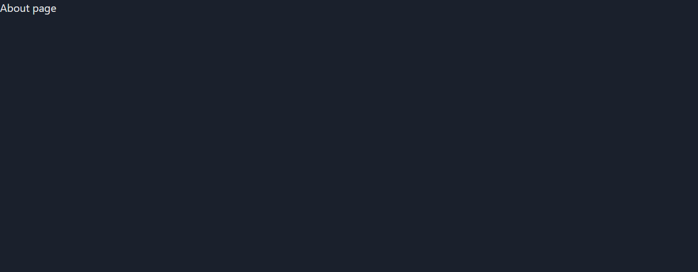
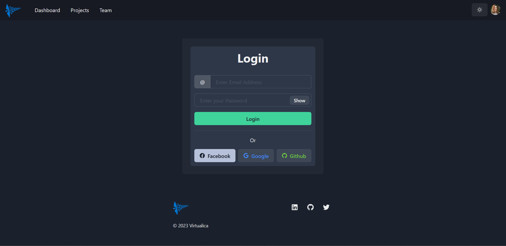

## A transferable Block Chain to handel EMRS ##

Pre-Requisites (Modules and Dependencies)

1. Install Node JS https://nodejs.org/en/
2. Install Go Lang https://go.dev/dl/
3. Execute `npm init -y` to create a package.json file.
4. Execute `npm install react react-dom` to install ReactJS , ReactDOM.
5. Execute `npm install --save react-router-dom` to install React Router.
6. Execute `npm install --save-dev @types/react @types/react-dom` for typeScript compatability.
7. Execute `npm install --save-dev esbuild` for installing esbuild bundler.
8. Execute `npm install @chakra-ui/react @emotion/react @emotion/styled framer-motion` to install chakra-ui framework.
9. Execute `npm install react-icons --save` to install react icons.
10. Execute `go get github.com/gofiber/fiber/v2` in terminal to install the fiber framework.
11. Execute `go get github.com/gofiber/template/html` in terminal to install the html templates.
12. Execute `go get github.com/joho/godotenv` in terminal to install the env module.
13. Execute `npm install --save-dev esbuild-sass-plugin` for installing the scss plugin required by esbuild.

## How to run the server on Local Host ##

* Once all the dependencies and modules are installed then run main.go file by using the command 
`go run main.go` . Output should be similar to the following :

* Proceed to click on the link, or you can type in `localhost:3000/` in your browser . 

* You will be greeted to the following main page :

* It's still WIP but this will be where the main page of the project be.

* Then please proceed to the URL box at the top of the browser and please enter `http://127.0.0.1:3000/login` to load the login Page which will look as follows : 

* Similarly, if you enter `http://127.0.0.1:3000/signUp` the sign-up page will be rendered which is as follows:.

## Updating the React javascript files ##

* Once you have modified the React files then execute the command `npm run dev` which will optimize the React
files making it deployment ready . 
* Once the build is completed (after ⚡ Build complete! ⚡ you can press `Ctrl + C`) you can run the server again by executing `go run main.go`

